# 📱 Yalla Notlop App

Yalla Notlop is a Flutter-based mobile application that simplifies the **group ordering process** between friends, coworkers, or family members.

The app allows users to create shared orders, pass the phone between participants, share orders through social media platforms, and let each member add their own items easily.

With offline-first functionality, all data is stored locally, making the application fast, lightweight, and fully usable without an internet connection.

---

## 🚀 Features

### 👥 Group Ordering
- Create a shared order
- Pass the phone between members
- Each member adds their own order
- View all members and their items
- Calculate the final order easily

### 🍔 Restaurant Management
- Add Restaurants
- Edit Restaurants
- Delete Restaurants
- Browse available restaurants

### 📂 Category Management
- Add Categories
- Edit Categories
- Delete Categories
- Organize restaurants by category

### 👤 Member Management
- Add members to an order
- Manage member information
- View each member's order separately

### 📋 Order Management
- Create orders
- Manage order details
- Track order status
- Save completed orders in history

### 🎨 User Experience
- Clean and simple UI
- Multi-language support
- Smooth navigation

---

## 🧠 Architecture

- Separation between UI & Business Logic
- Feature-based Project Structure
- Scalable and maintainable codebase

---

## 🛠 Tech Stack

- Flutter
- Dart
- Bloc / Cubit
- Hive Local Database
- Localization
- Dependency Injection / Get It
- Share plus & Screenshot Packages

---

## 💾 Offline First

Yalla Notlop works completely offline.

All data including:
- Restaurants
- Categories
- Members
- Orders
- Order History

is stored locally using Hive, allowing users to access and manage their data without an internet connection.

---

## 📱 Main Features

- Shared group ordering
- Pass phone between members
- Restaurant management
- Category management
- Member management
- Order history
- Offline data storage
- Localization support
- Dark and Light themes

---

## 📱 Screenshots

  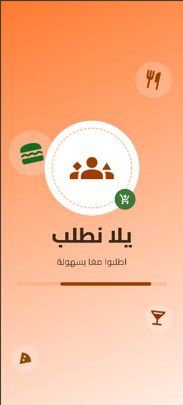
  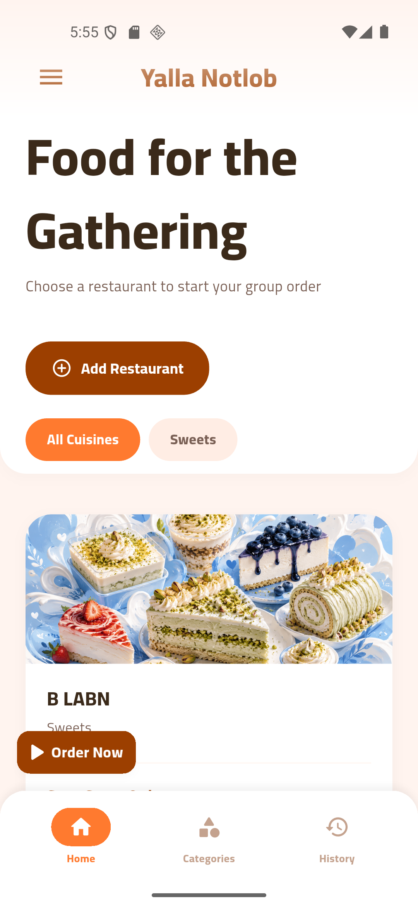
  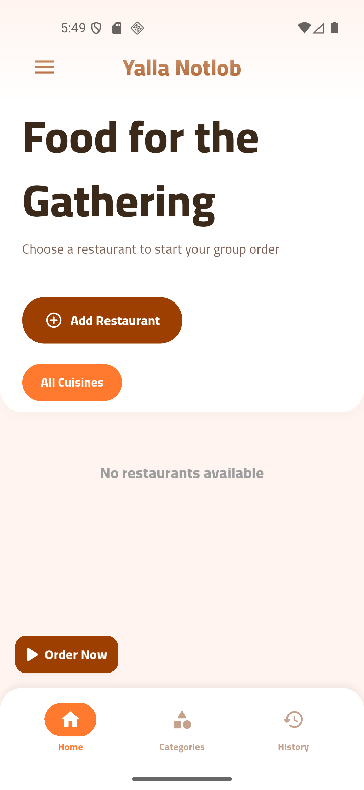

  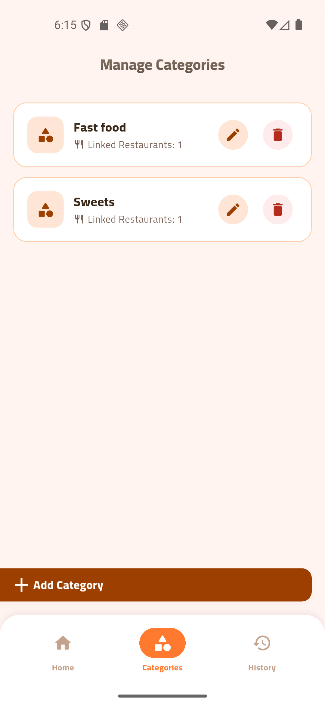
  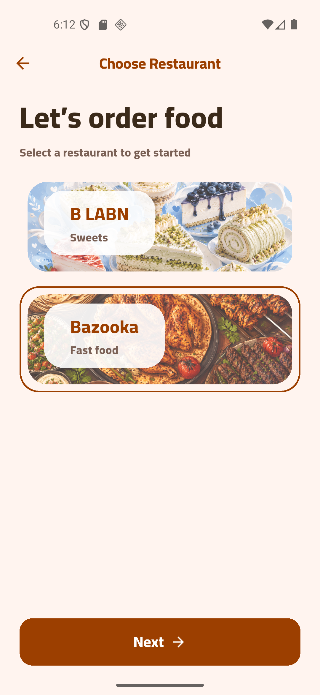
  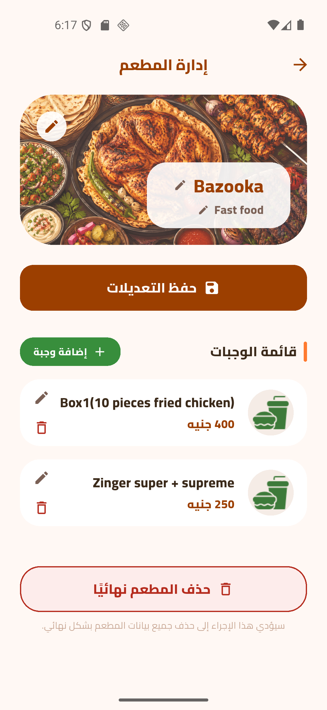

  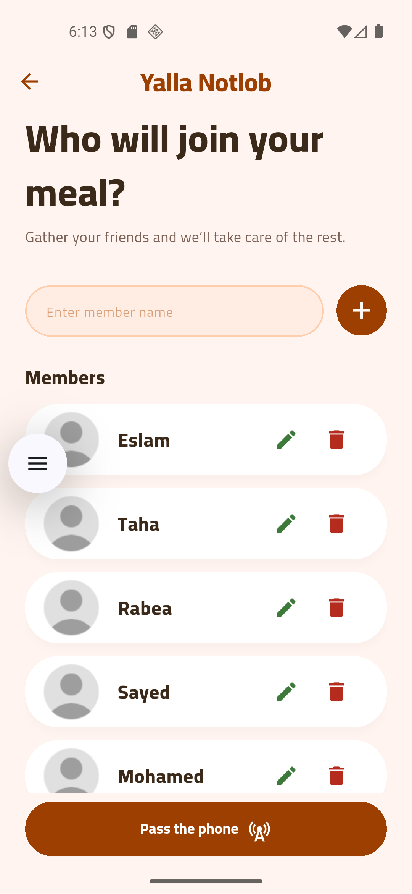
  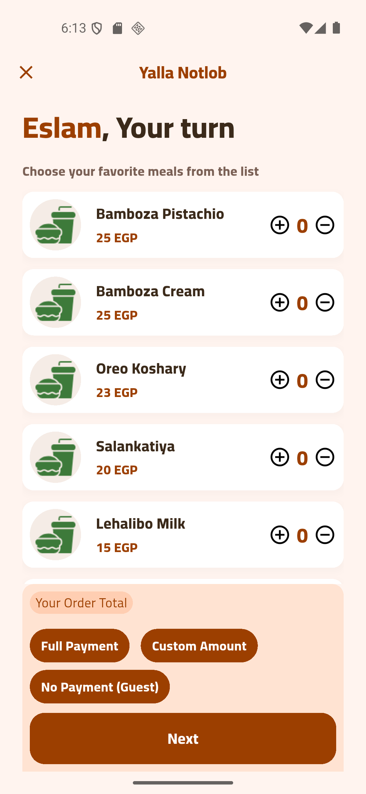
  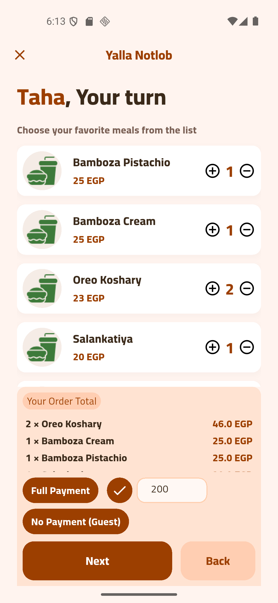

  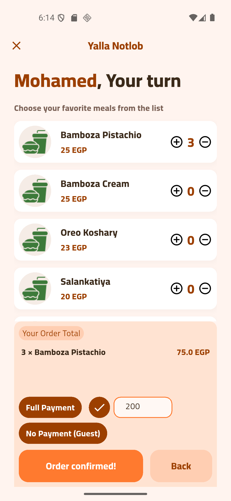
  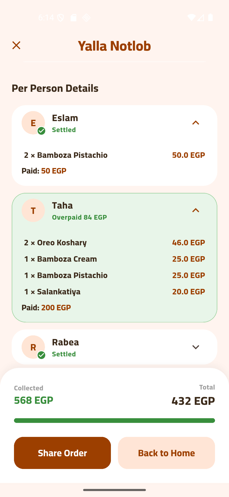
  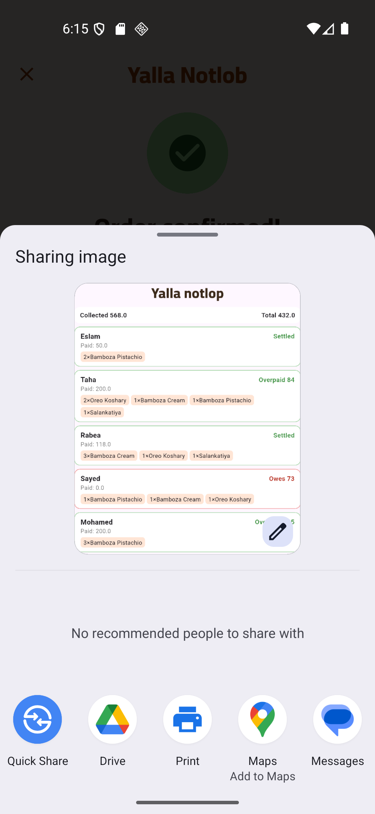

  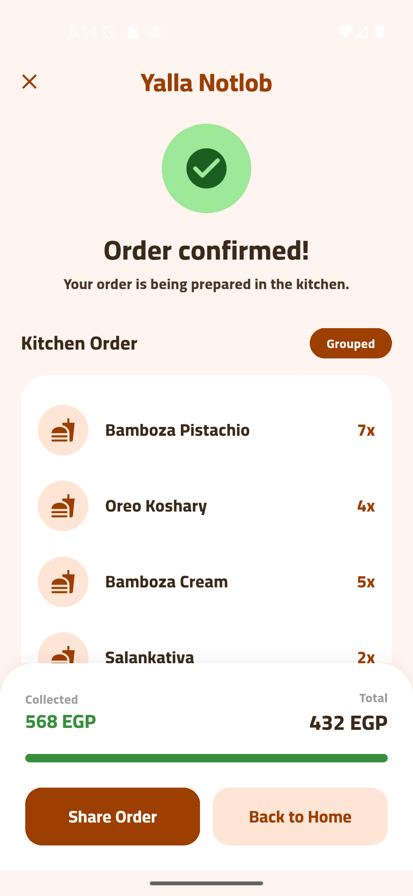
  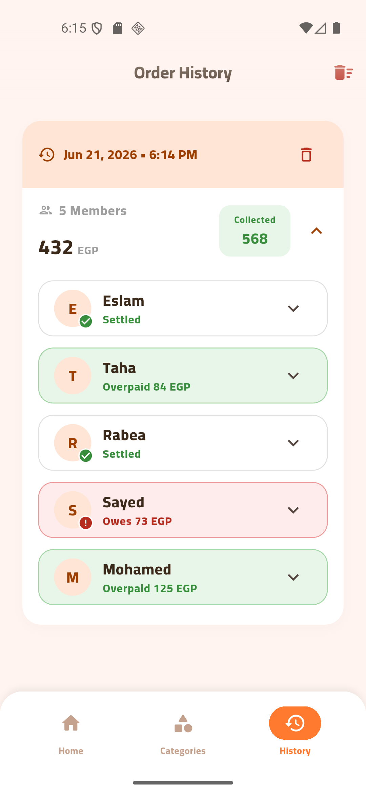
  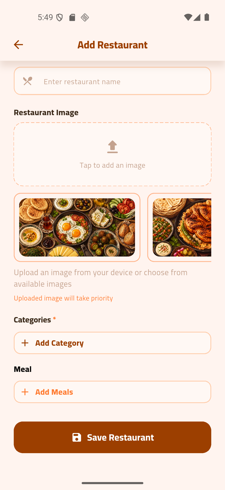

  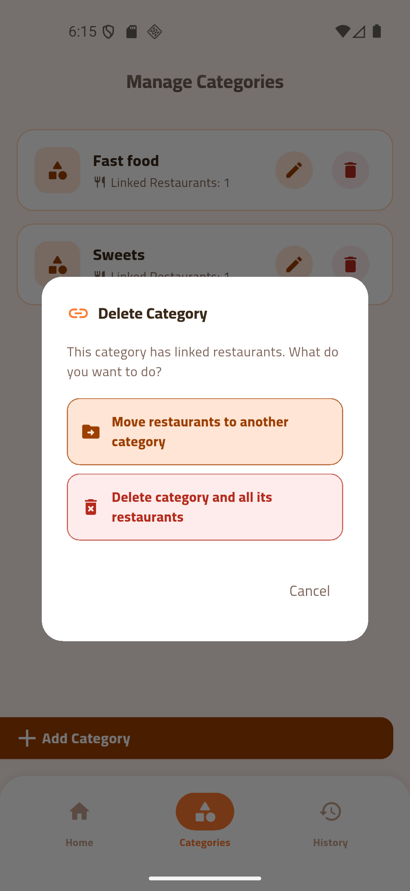
  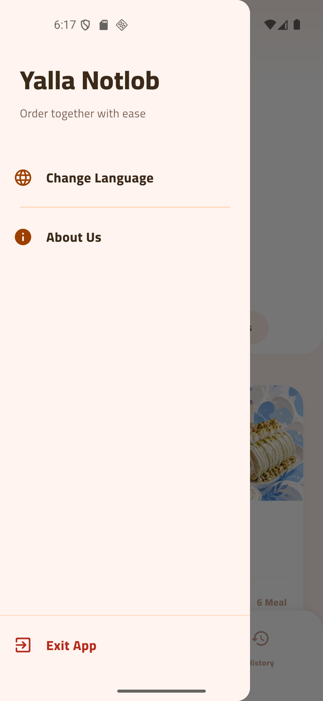
  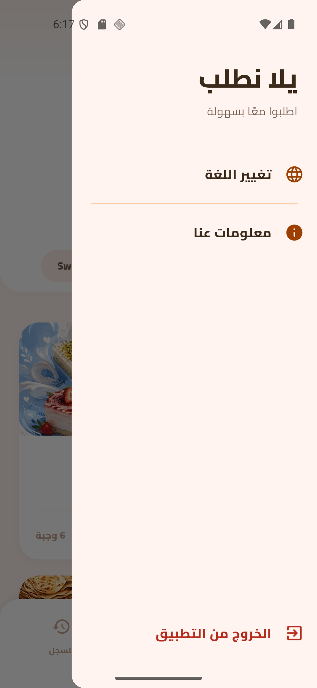

  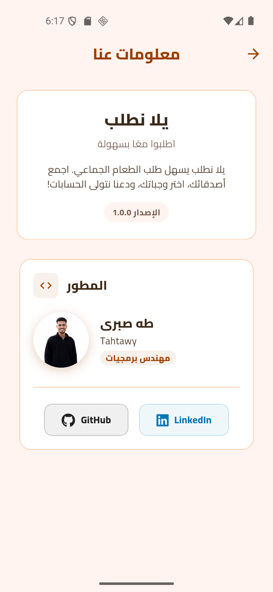

